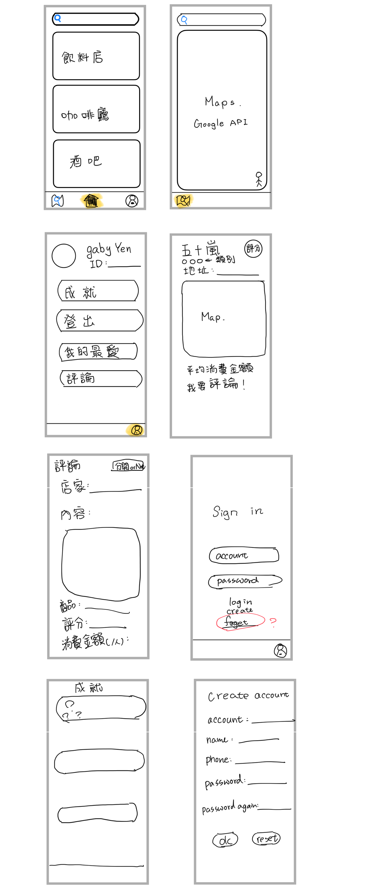

# APP_FinalProject
Project of System Techniques and R&amp;D Design of Innovative Mobile Networks Apps 

# 功能 func
def login(account,password)
return (bool, userNo.)

def search(str) 
return storelist
str 可能是商店類別或名城其中幾個字

# 預期頁面

